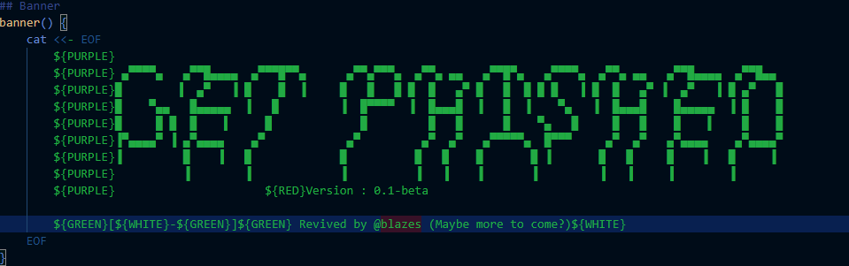

<!-- get-phished -->

<p align="center">
  
</p>

<p align="center">
  
</p>

<p align="center">
  
  
  
  
</p>

<p align="center">get-phished with a couple Kik related pages. (Might be updated?)</p>

##

### Features

- Latest and updated login pages.
- Mask URL support 
- Beginner friendly
- Docker support (checkout `docker-legacy` branch)
- Multiple tunneling options
  - Localhost
  - Ngrok (With or without hotspot)


### Installation

- Just, Clone this repository -
```
$ git clone git://github.com/htr-tech/get-phished.git
```

- Cd into the directory and run `get-phished.sh` -
```
$ cd get-phished
$ sudo bash get-phished.sh
```

- On first launch, It'll install the dependencies and that's it. `Get-phished` is installed.

### Run on Docker
```
$ docker pull htrtech/get-phished
$ docker run --rm -it htrtech/get-phished
```

### Dependencies

**`get-phished`** requires following programs to run properly - 
- `php`
- `wget`
- `curl`
- `git`

> All the dependencies will be installed automatically when you run `get-phished` for the first time.

> Supported Platform : **`Termux`**, **`Ubuntu/Debian/Kali`**, **`Arch Linux/Manjaro`**, **`Fedora`**

##

<h3 align="center">
:: Workflow ::
</h3>
<p align="center">

</p>

### Find Me on :
<p align="left">
  <a href="http://kik.me/blazes" target="_blank"></a>
  
